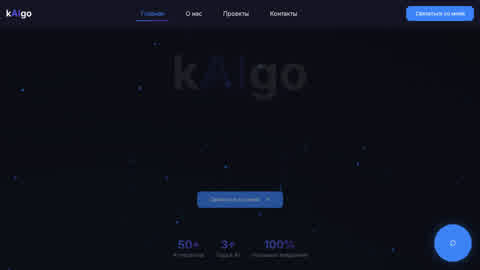

# Kaigo Widgets

Платформа для AI-виджетов на домене [kaigo.online](https://kaigo.online). Проект хранит заказчиков, пользователей и настройки виджетов в PostgreSQL, а историю сообщений виджетов - в отдельной SQLite-базе.

На текущем сервере этот проект живёт рядом с отдельной статической визиткой: корень домена и часть SPA-маршрутов отдаются из `/root/kaigo/dist`, а маршруты виджетов проксируются в aiohttp-приложение на `127.0.0.1:8080`.

## Что сейчас развернуто

- Домен: `kaigo.online`
- Nginx проксирует неперехваченные статикой пути на `127.0.0.1:8080`
- Docker-сервисы: `ai_project_app`, `ai_project_db`
- Статический сайт на корне: `/root/kaigo/dist`
- Публичный демо-виджет: [`/w/demka`](https://kaigo.online/w/demka)
- Админка приложения: `http://127.0.0.1:8080/admin` на сервере
- Кабинет клиента: [`/client/login`](https://kaigo.online/client/login)
- Healthcheck приложения: [`/api/health`](https://kaigo.online/api/health)
- Healthcheck Gemini: [`/api/health/ai`](https://kaigo.online/api/health/ai)

Публичный `/admin/...` сейчас перехватывается статическим сайтом и не попадает в aiohttp-админку. Если админка должна открываться снаружи через домен, добавьте отдельный nginx `location ^~ /admin` с `proxy_pass http://127.0.0.1:8080` перед статическими SPA-location.

## Скриншоты

| Страница | Скриншот |
| --- | --- |
| Корень домена |  |
| Публичный виджет |  |
| Вход в админку приложения |  |
| Вход клиента |  |

## Карта экранов

Публичный домен:

- `/` - статическая визитка из `/root/kaigo/dist`
- `/w/{slug}` - публичная страница виджета, например `/w/demka`
- `/w/{slug}?version=N` - предпросмотр конкретной версии ассета виджета

Кабинет клиента:

- `/client/login` - вход заказчика
- `/client` - список виджетов заказчика
- `/client/widgets/{id}/dialogs` - последние диалоги по виджету

Внутренняя aiohttp-админка:

- `/admin` или `/admin/widgets` - список виджетов
- `/admin/widgets/new` - создание виджета
- `/admin/widgets/{id}` - обзор настроек, доменов и последних сообщений
- `/admin/widgets/{id}/edit` - редактирование настроек
- `/admin/widgets/{id}/assets` - версии HTML/CSS/JS ассетов
- `/admin/widgets/{id}/assets/{version}/preview` - предпросмотр версии
- `/admin/tenants` - заказчики и доступы

Публичный `/admin/...` сейчас перехватывается статической SPA. Настоящая админка открывается на сервере через `http://127.0.0.1:8080/admin`.

## Стек

- Python 3.11
- aiohttp
- SQLAlchemy + asyncpg
- PostgreSQL
- SQLite + aiosqlite для истории сообщений
- Google AI Studio Gemini API: OpenAI-compatible endpoint для чата и native `generateContent` для аудио
- Google Docs API как опциональный источник системного промпта
- Docker Compose + Nginx

## Маршруты nginx/static

| Route | Назначение |
| --- | --- |
| `/` | Статическая визитка из `/root/kaigo/dist` на публичном домене |
| `/assets/*` | Статические assets визитки |
| `/about*`, `/projects*`, `/project/*`, `/login*`, `/auth*`, `/admin*` | SPA-маршруты визитки, отдаются через `index.html` |

## Маршруты aiohttp backend

| Route | Назначение |
| --- | --- |
| `/api/health` | Проверка доступности aiohttp-приложения |
| `/api/health/ai` | Проверка ключа, модели и chat endpoint Google AI Studio |
| `/w/{slug}` | Публичная страница виджета |
| `/w/{slug}/api/send` | Отправка текстового сообщения в AI |
| `/w/{slug}/api/history` | История текущего пользователя виджета |
| `/w/{slug}/api/audio` | Отправка аудио на распознавание и обработку |
| `/admin` | Админка виджетов и заказчиков, доступна напрямую на `127.0.0.1:8080` |
| `/client/login` | Вход клиента, проксируется через публичный домен |

Если открыть само aiohttp-приложение напрямую, `/` редиректит в `/admin`.

## Переменные окружения

Скопируйте `.env.example` в `.env` и заполните значения:

```bash
cp .env.example .env
```

Ключевые переменные:

- `DATABASE_URL` - PostgreSQL DSN для SQLAlchemy, например `postgresql+asyncpg://user:password@db:5432/dbname`
- `POSTGRES_USER`, `POSTGRES_PASSWORD`, `POSTGRES_DB` - параметры контейнера PostgreSQL
- `GOOGLE_AI_API_KEY` - ключ Google AI Studio. Также поддерживаются алиасы `GOOGLE_API_KEY` и `GEMINI_API_KEY`
- `GOOGLE_AI_MODEL` - модель чата, по умолчанию `gemini-2.5-pro`
- `GOOGLE_AI_STT_MODEL` - модель для аудио-транскрибации, по умолчанию `gemini-2.5-flash`
- `GOOGLE_AI_BASE_URL` - официальный OpenAI-compatible endpoint Gemini, по умолчанию `https://generativelanguage.googleapis.com/v1beta/openai/`
- `GOOGLE_AI_NATIVE_BASE_URL` - native Gemini endpoint для `generateContent`, по умолчанию `https://generativelanguage.googleapis.com/v1beta`
- `GOOGLE_AI_REQUEST_TIMEOUT` - таймаут запроса к Google AI Studio в секундах
- `GOOGLE_AI_MAX_RETRIES` - число повторов запроса SDK, по умолчанию `0`
- `MESSAGE_DATABASE_URL` - путь к SQLite истории сообщений, по умолчанию `/app/data/dialogs.sqlite3`
- `PROMPT_GOOGLE_DOC_URL` - Google Doc с системным промптом и блоком `---TOOLS---`
- `SERVICE_ACCOUNT_FILE` - путь к JSON-credentials Google service account, если нужен Google Docs prompt
- `DEFAULT_SYSTEM_PROMPT` - fallback-промпт, если Google Docs недоступен
- `ADMIN_PASSWORD` - общий пароль для входа в админку
- `ADMIN_EMAILS` - опциональный список разрешенных email через запятую

Не коммитьте `.env`, `credentials.json`, `.session`, логи и локальные базы.

## Запуск

```bash
docker compose up -d --build
docker compose logs -f app
```

Проверка:

```bash
curl http://127.0.0.1:8080/api/health
curl http://127.0.0.1:8080/api/health/ai
curl http://127.0.0.1:8080/w/demka
```

## База данных

PostgreSQL хранит:

- `tenants`
- `users`
- `widgets`
- `widget_assets`
- `widget_bindings`

Схема создается при старте приложения через SQLAlchemy metadata. Alembic-миграции лежат в `migrations/`, но на текущем сервере таблица `alembic_version` не была заведена.

SQLite хранит историю сообщений виджетов. Для Docker она вынесена в volume `./data:/app/data`.

## Gemini AI и промпты

Виджет отправляет текстовые запросы в официальный Google AI Studio Gemini API через OpenAI-compatible endpoint. Голосовые сообщения распознаются через native Gemini `generateContent` с аудио-входом. Если Google Docs credentials отсутствуют или Google Docs недоступен, приложение использует `DEFAULT_SYSTEM_PROMPT` и продолжает отвечать.

Модель чата по умолчанию: `gemini-2.5-pro`. Если в базе остались старые значения вроде `google/gemini-2.5-flash`, сервис автоматически убирает префикс `google/`. Старые несовместимые значения заменяются на `GOOGLE_AI_MODEL` с warning в логах.

Проверить именно chat endpoint можно так:

```bash
curl http://127.0.0.1:8080/api/health/ai
```

Ответ `{"status":"ok"}` означает, что Google AI Studio принял ключ и модель. Если endpoint возвращает `missing_api_key`, добавьте `GOOGLE_AI_API_KEY`, `GOOGLE_API_KEY` или `GEMINI_API_KEY` в `.env`. Если возвращает `invalid_api_key`, ключ не принят Google AI Studio. Если возвращает `model_not_found`, проверьте `GOOGLE_AI_MODEL` или модель конкретного виджета.

Если AI возвращает `Connection error`, проверьте DNS внутри контейнера:

```bash
docker exec -i ai_project_app python - <<'PY'
import socket
for host in ["generativelanguage.googleapis.com", "oauth2.googleapis.com"]:
    print(host, socket.getaddrinfo(host, 443)[0][4])
PY
```

В `docker-compose.yml` для приложения уже задан DNS `1.1.1.1` и `8.8.8.8`; после изменения compose нужно пересоздать контейнер.

После добавления или замены Google AI Studio ключа пересоздайте контейнер:

```bash
docker compose up -d --force-recreate app
```

## Безопасность

- Приложение и PostgreSQL в compose привязаны к `127.0.0.1`, наружу их должен публиковать только Nginx.
- На продакшене задайте `ADMIN_PASSWORD`.
- Для ограничения админки по email задайте `ADMIN_EMAILS`.
- Секреты не должны попадать в Docker image и Git. Для этого настроены `.gitignore` и `.dockerignore`.

## Обслуживание

Посмотреть контейнеры:

```bash
docker compose ps
```

Логи приложения:

```bash
docker compose logs -f app
```

Бэкап PostgreSQL:

```bash
docker exec ai_project_db pg_dump -U "$POSTGRES_USER" "$POSTGRES_DB" > backup.sql
```

Бэкап истории сообщений:

```bash
cp data/dialogs.sqlite3 dialogs.sqlite3.backup
```
