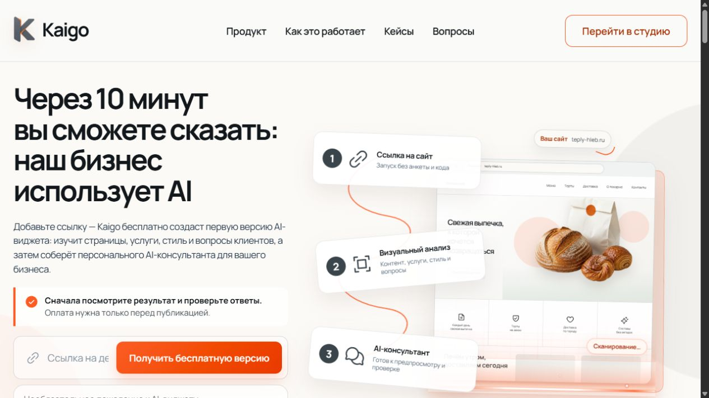

# Kaigo Widgets

Kaigo Widgets — backend-платформа на Python/aiohttp для публикации и управления AI-виджетами на сайтах. У каждого виджета есть собственный slug, сценарий и версия HTML/CSS/JS; публичный чат обрабатывает сообщения через Gemini, а заказчик видит свои виджеты и последние диалоги в кабинете.

[Демо-виджет](https://kaigo.online/w/demka) · [Kaigo Widgets](https://kaigo.space/) · [Вход в кабинет](https://kaigo.online/client/login)

Скриншот главной страницы действующего продукта от 9 сентября 2026 года. Конфигурация развёрнутого сервиса может отличаться от локального окружения.

## Что есть в репозитории

- публичная страница виджета: /w/{slug};
- API для текстовых сообщений, истории и аудио: /w/{slug}/api/send, /history, /audio;
- клиентский кабинет с авторизацией и просмотром последних диалогов;
- админка для заказчиков, виджетов, доменов, настроек и версий ассетов;
- готовые сценарии для демо-виджетов: стоматология, недвижимость, автосервис и салон красоты.

Промпт может быть inline-текстом или загружаться из Google Docs. Для текста используется Gemini через Google AI Studio; для аудио предусмотрен отдельный native Gemini endpoint.

## Архитектура и стек

- Python 3.11, aiohttp, aiohttp-session;
- SQLAlchemy, asyncpg, PostgreSQL — заказчики, пользователи, виджеты и привязки;
- SQLite/aiosqlite — история сообщений виджетов;
- Docker Compose и Nginx;
- Google AI Studio Gemini для чата и распознавания аудио.

Минимальный локальный запуск:

~~~bash
cp .env.example .env
# заполнить DATABASE_URL и настройки провайдера в .env
docker compose up -d --build
docker exec ai_project_app python scripts/seed_widget_presets.py
curl http://127.0.0.1:8080/api/health
curl http://127.0.0.1:8080/w/demka
~~~

Операционные, серверные и административные инструкции сохранены отдельно: [OPERATIONS.md](OPERATIONS.md).

> Этот репозиторий — backend Kaigo Widgets. Отдельный [NNFall/kaigo](https://github.com/NNFall/kaigo) — экспериментальный лендинг с анимацией и видео, а не часть этого backend.
