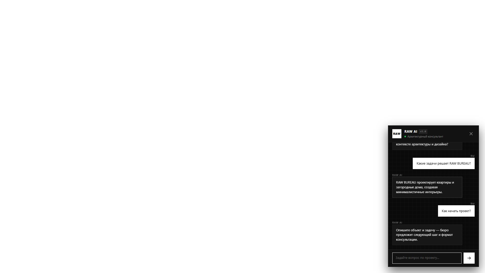
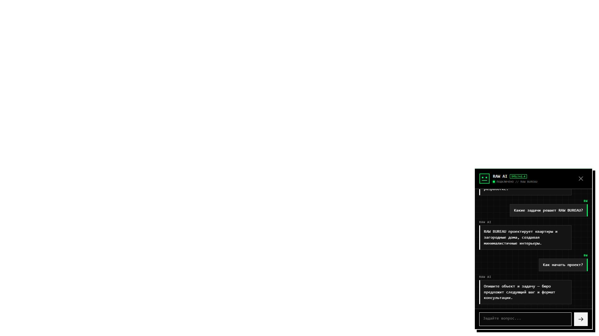
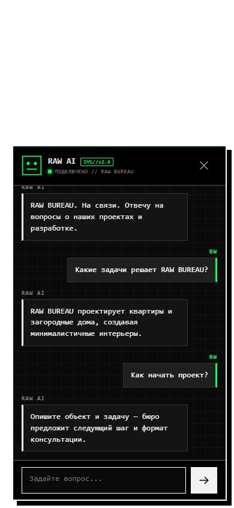

# RAW BUREAU: воспроизводимый Direct A/B/C-прогон

Дата финального прогона: 24 июля 2026 года.

Публичное сравнение:  
<https://kaigo.space/builder-comparison/direct-abc-v3/>

Живые варианты:

- [Product Chat](https://kaigo.space/builder-comparison/direct-abc-v3/product-chat)
- [Brand Motion](https://kaigo.space/builder-comparison/direct-abc-v3/brand-motion)
- [AI Character](https://kaigo.space/builder-comparison/direct-abc-v3/ai-character)

## Что именно сравнивалось

Все три варианта получили один и тот же зафиксированный пакет данных RAW BUREAU:

- source digest: `ce9413f7ddabb5e6c6379ffa510c2abedfea4ef91adb5855e2ed737e1d408ed5`;
- common input digest: `b960710d15cf2463815354ccf993036fab582c4cf690f5e3cb9baf59917b3a6c`;
- контракт: `chat-v1`;
- генератор: Direct Gemini API, не Antigravity;
- модель генерации и визуального критика: `gemini-3.6-flash`;
- thinking level: `high`;
- creativity: `0.9`;
- browser timeout: `10 000 ms`, общий browser deadline: `120 s`;
- critic timeout: `180 s`;
- разрешены собственные HTML, CSS, JavaScript и анимации внутри sandbox.

Цена зафиксирована по официальной странице Gemini:

- input: `$1.50` за 1 млн токенов;
- output и thinking: `$7.50` за 1 млн токенов;
- для рублёвого сравнения используется конфигурационный курс `100 ₽/$`.

## Как устроен цикл

1. Аналитик сайта формулирует бренд и продуктовый контекст.
2. Conversation designer задаёт структуру настоящего чата.
3. Art director/frontend-роль собирает самостоятельный виджет.
4. Обычный код валидирует schema, контракт, размеры, доступность, состояния и безопасность.
5. Chromium исполняет HTML/CSS/JS, делает два диалоговых хода и шесть скриншотов.
6. Независимый Gemini-критик получает скриншоты и метрики BrowserAudit.
7. Если JSON критика семантически противоречив, допускается ровно один корректирующий повтор с очищенной точной ошибкой.
8. Визуальная ревизия допускается только по полям, явно разрешённым находками критика.
9. Live registry получает только вариант со строгим `PASS`.

Это не автономный Antigravity/Codex-агент. Это управляемый harness вокруг обычных structured Gemini API-вызовов, Chromium и локальных детерминированных проверок.

## Три исторических прогона

| Прогон | Результат | Стоимость | Что выявил |
|---|---:|---:|---|
| Run 1 | 0/3 приняты | `$2.737068` / `273,71 ₽` | Ошибки теряли часть диагностик; один browser failure и один отклонённый revision нельзя было честно разобрать до конца. |
| Run 2 | 0/3 опубликованы | `$2.6744235` / `267,44 ₽` | Product и Brand упали на противоречивой structured-оценке критика. AI Character реально прошёл strict review, но старый runner ошибочно потребовал обязательную ревизию. |
| Run 3 | 3/3 приняты | `$2.6021415` / `260,21 ₽` | Исправленные evidence, acceptance gate и semantic retry дали полностью проверенный пакет. |

Run 1 и Run 2 сохранены как неизменяемые исторические доказательства:

- <https://kaigo.space/builder-comparison/direct-abc-v1-run1/>
- <https://kaigo.space/builder-comparison/archive/direct-abc-v2-run2/>

Manifest-файлы всех трёх прогонов сохранены в
[`docs/evidence/raw-bureau-abc`](evidence/raw-bureau-abc/).

## Финальный Run 3

| Профиль | Статус | Время | Токены | Стоимость | Визуальная ревизия |
|---|---:|---:|---:|---:|---:|
| Product Chat | completed / strict PASS | 446,7 s | 192 830 | `$0.921297` / `92,13 ₽` | нет |
| Brand Motion | completed / strict PASS | 492,1 s | 222 376 | `$1.044156` / `104,42 ₽` | нет |
| AI Character | completed / strict PASS | 327,1 s | 137 951 | `$0.6366885` / `63,67 ₽` | нет |

Все три raw-кандидата прошли строгий review без повторной визуальной генерации:
`visual_revision_performed = false`.

### Product Chat


Самый спокойный и функциональный вариант: явное разделение `ВЫ` / `RAW AI`,
компактная чёрная панель и минимум декоративного шума.

### Brand Motion



Самый брендовый вариант: RAW-маркер, архитектурная сетка, более выразительное
открытие и интерактивные состояния.

### AI Character



Самый характерный вариант: отдельный зелёный AI-глиф, системная типографика и
более заметная персонализация сотрудника.

Мобильное состояние AI Character:



## Проверка живого продукта

Встроенный браузер Codex проверил опубликованные страницы, а не локальный макет:

- все три live URL вернули HTTP 200;
- в каждом варианте отправлено по два настоящих вопроса;
- получено шесть ответов Gemini;
- сообщения пользователя находятся справа, AI — слева;
- быстрые подсказки исчезают после начала диалога;
- закрытие и повторное открытие сохраняют историю;
- Product Chat корректно сообщил, что неизвестных данных нет, вместо выдумывания;
- в viewport `390×844` панель AI Character заняла примерно `297×360` внутри
  доступной области preview `329×514`, то есть не стала fullscreen;
- чистая контрольная вкладка после загрузки и открытия дала `errors: []`.

Публичный manifest на сервере побитно совпал с локальным:

```text
35d6bf3b4974219d10a02238a06950b880b516132ca0896c21a8626c6c20dd36
```

## Что ещё не идеально

- Три направления различаются, но наследуют одну очень строгую монохромную
  систему RAW BUREAU. Для следующего сайта нужно проверить больший цветовой и
  композиционный разброс.
- AI Character сейчас использует сгенерированный CSS/SVG-подобный глиф, а не
  отдельный иллюстративный персонаж.
- Строгий critic оставил неблокирующие замечания по `craft_polish` у Brand Motion
  и AI Character. Они не нарушают chat-контракт, но сохранены рядом с manifest и
  должны учитываться при следующей итерации prompt.
- Стоимость Run 3 включает генерацию, thinking, BrowserAudit-контекст и
  визуального критика. Стоимость последующей живой переписки посетителей
  учитывается отдельно.

## Где лежат доказательства

В репозитории сохранены:

- manifests Run 1, Run 2 и Run 3;
- desktop/mobile-кадры финальных трёх вариантов;
- полные JSON-ответы strict critic для Run 3;
- по одному кадру Run 1 и Run 2 для визуальной истории.

Полный публичный Run 3 остаётся на `kaigo.space`, а закрытые live snapshots
хранятся отдельно от публичных evidence-файлов и доступны только процессу
`builder-lab`.
