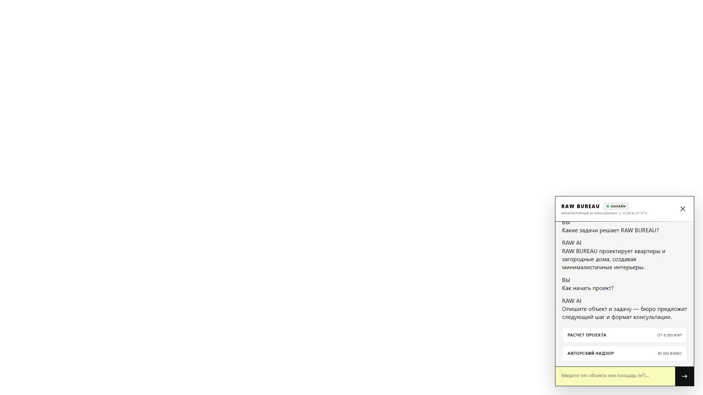
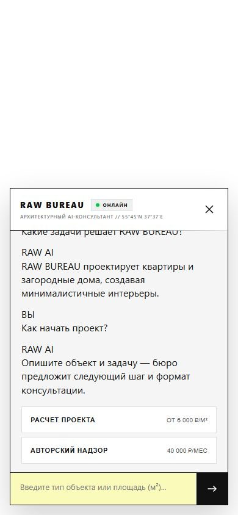
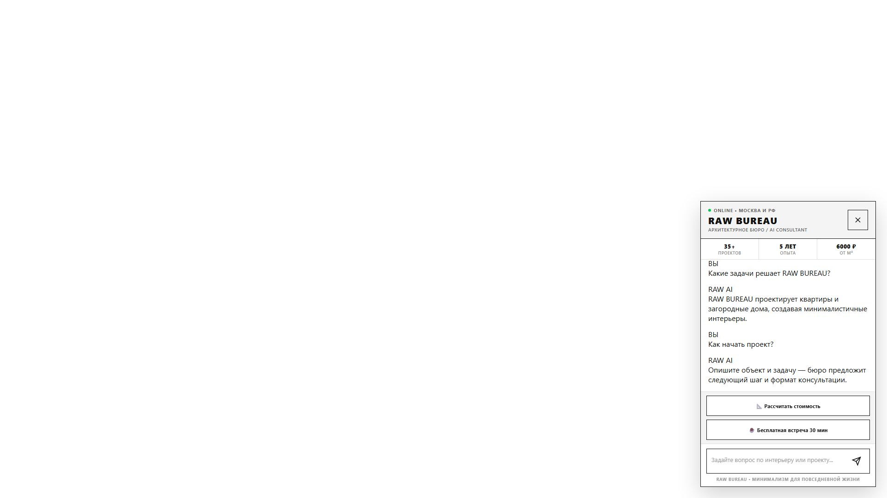
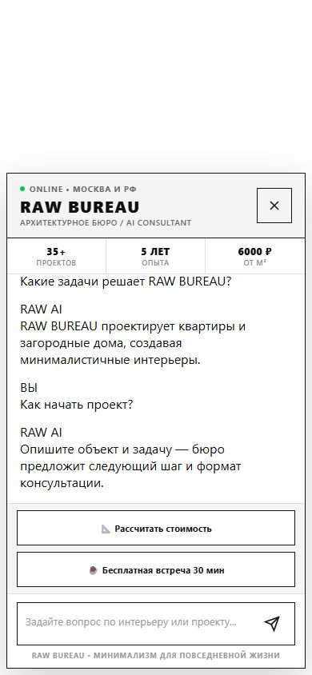
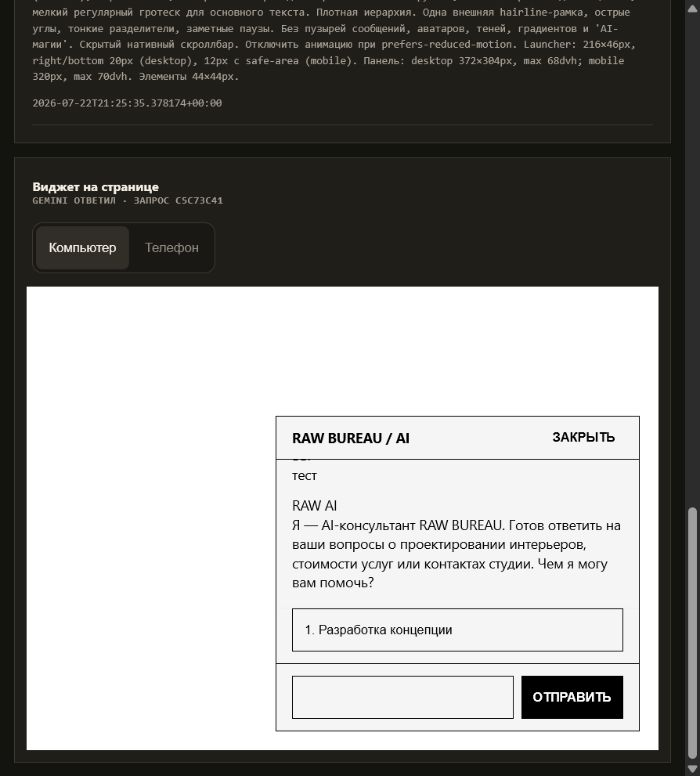

# RAW BUREAU: зафиксированное сравнение v1

Дата запуска: 23 июля 2026 года.

Исходный набор данных одинаков для обоих вариантов. SHA-256 входного bundle:
`ce9413f7ddabb5e6c6379ffa510c2abedfea4ef91adb5855e2ed737e1d408ed5`.

## Публичные версии

- [Страница сравнения](https://kaigo.space/builder-comparison/index.html)
- [Direct Gemini 3.6 Flash](https://kaigo.space/builder-comparison/direct-3-6/)
- [Antigravity](https://kaigo.space/builder-comparison/antigravity-3-6/)
- [Предыдущий baseline](https://kaigo.space/builder-comparison/archive/raw-bureau-v1/)

## Метрики

| Вариант | Ввод | Ответ | Thinking | Всего | Время |
| --- | ---: | ---: | ---: | ---: | ---: |
| Direct | 86 463 | 54 260 | 89 341 | 230 064 | 701,521 с |
| Antigravity | 3 219 461 | 120 671 | 66 205 | 3 406 337 | 1 328,659 с |

Для сопоставимой оценки использована стандартная ставка Gemini 3.6 Flash:
$1,50 за 1 млн входных токенов и $7,50 за 1 млн выходных токенов, включая
thinking. Курс проекта для внутренней оценки: 100 ₽ за $1.

| Вариант | Оценка, USD | Оценка, RUB |
| --- | ---: | ---: |
| Direct | $1,206702 | 120,67 ₽ |
| Antigravity | $6,230762 | 623,08 ₽ |

Antigravity в этом запуске стоил примерно в 5,16 раза дороже Direct. Для Antigravity
это оценка по опубликованной стандартной ставке модели, которая обслуживала agent
preview. Отдельные Google Cloud SKU, налоги, скидки и округление счёта здесь не учтены.

## Зафиксированные изображения

### Direct

### Antigravity

### Предыдущий baseline

## Вывод

Оба варианта технически прошли реальный двухходовый чат, responsive-проверку,
закрытие и повторное открытие. Однако визуальная проверка была недостаточно строгой:
она подтверждала работоспособность transcript, но не требовала, чтобы пользователь и
AI выглядели как разные стороны разговора. Direct дополнительно пострадал от
рассинхронизации между селекторами сгенерированного стартового сообщения и сообщениями,
которые позже добавляет фиксированный runtime.

Следующая версия развивается только по Direct-пути и вводит chat-first контракт.

