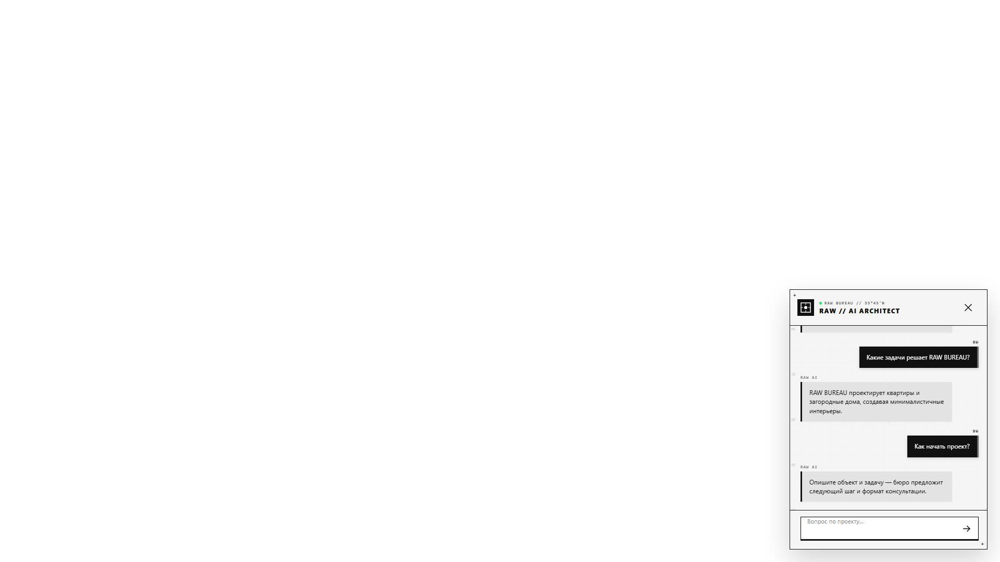
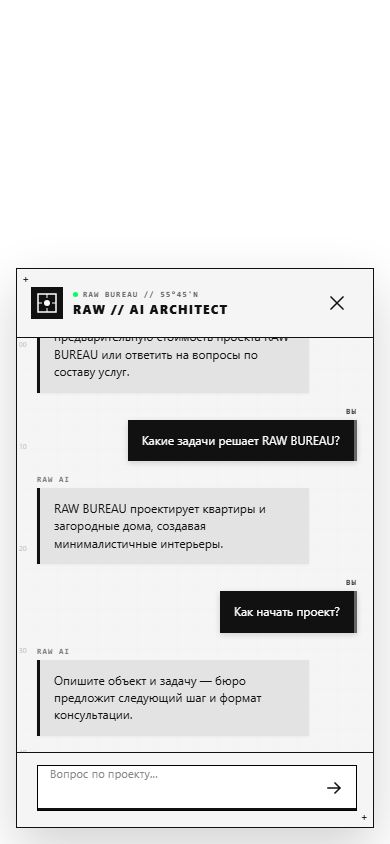

# RAW BUREAU: Direct Chat v2

Дата фиксации: 23 июля 2026 года.

## Публичная версия

- [Direct Chat v2](https://kaigo.space/builder-comparison/direct-chat-v2/)
- [Страница сравнения](https://kaigo.space/builder-comparison/index.html)
- [Direct v1](https://kaigo.space/builder-comparison/direct-3-6/)
- [Antigravity v1](https://kaigo.space/builder-comparison/antigravity-3-6/)

Новая версия продолжает только Direct-направление. Старые Direct, Antigravity и baseline
оставлены опубликованными для сравнения.

## Стоимость зафиксированного сравнения v1

Для внутренней оценки использован курс 100 ₽ за $1 и стандартная ставка Gemini 3.6 Flash:
$1,50 за 1 млн входных токенов и $7,50 за 1 млн выходных токенов, включая thinking.

| Вариант | Ввод | Вывод | Thinking | Время | Оценка |
| --- | ---: | ---: | ---: | ---: | ---: |
| Direct v1 | 86 463 | 54 260 | 89 341 | 701,521 с | 120,67 ₽ |
| Antigravity v1 | 3 219 461 | 120 671 | 66 205 | 1 328,659 с | 623,08 ₽ |

Antigravity в зафиксированном запуске стоил примерно в 5,16 раза дороже Direct. Для
Antigravity это сопоставимая оценка по ставке модели: отдельные Cloud SKU, инфраструктура,
налоги, скидки и округление счёта не учтены.

## Что изменено в концепции

Генератор теперь обязан строить именно разговор, а не информационную панель:

- сообщения AI располагаются слева, сообщения посетителя — справа;
- у сторон есть различимые поверхности или «пузыри» и подписи автора;
- приветствие короткое и сразу объясняет, чем AI полезен;
- на первом экране допускается не более двух контекстных быстрых ответов;
- после первого вопроса быстрые ответы скрываются;
- постоянное меню, каталог услуг и набор декоративных кнопок запрещены;
- окно остаётся компактным на desktop, а на телефоне рекомендована высота 64–78% экрана;
- JavaScript и выразительные анимации разрешены, если не ломают чат и доступность;
- персонаж или аватар разрешён как часть характера бренда, но не является обязательным
  шаблоном для всех сайтов.

Важный принцип: генератору передаётся диапазон и продуктовый контракт, а не фиксированные
цвета, точная ширина или единый дизайн для каждого виджета.

## Что подтвердил аудит готовых решений

У [Chatwoot](https://www.chatwoot.com/features/widget-customization) брендирование
накладывается на знакомую структуру чата, а не заменяет её. У
[Botpress](https://botpress.com/docs/webchat/react-library/components/message-list/)
список сообщений, composer и другие части webchat разделены на самостоятельные элементы.
Открытый [assistant-ui](https://github.com/assistant-ui/assistant-ui) также строится вокруг
thread/message/composer-примитивов. Поэтому Kaigo не копирует их внешний вид, но закрепляет
тот же узнаваемый разговорный каркас и отдаёт Gemini свободу в брендовой оболочке,
анимациях и персонаже.

## Как получен результат

Модель `gemini-3.6-flash` получила тот же анализ `rawbureau.ru`, что и в предыдущем
сравнении, но новый chat-first контракт. Она сама создала HTML, CSS и JavaScript виджета.

Опубликован реальный артефакт четвёртой ревизии, стадия `conversation`:

- revision: 4;
- prompt: 107 220 токенов;
- output: 65 796 токенов;
- thinking: 65 873 токена;
- всего: 238 889 токенов;
- время запуска: 945,946 секунды;
- расчётная стоимость этого запуска: 114,83 ₽.

Последующая стадия `motion_polish` не была опубликована: браузерный gate отклонил её.
Повторная генерация не понадобилась. Диагностика показала две ошибки не в сгенерированном
дизайне, а в общем runtime:

1. runtime преобразовывал поле ввода в `textarea` и вычислял высоту, пока чат был скрыт;
   браузер возвращал `scrollHeight = 0`, поэтому инлайн-стиль обнулял поле;
2. launcher оставался интерактивным под открытой панелью.

После исправления runtime тот же артефакт revision 4 прошёл аудит без ручного
редактирования его HTML/CSS/JavaScript.

Два более ранних экспериментальных запуска были остановлены после зависаний Chromium.
Их usage не сохранился после перезапуска контейнеров, поэтому 114,83 ₽ — стоимость только
зафиксированного запуска, а не всех экспериментов этой итерации.

## Что проверяет обычный код

Это не «миллиард условий», а небольшой набор универсальных инвариантов:

- панель полностью помещается во viewport и не создаёт горизонтальный overflow;
- launcher скрыт и недоступен, пока чат открыт;
- поле ввода и кнопки видимы, не обрезаны и имеют touch-target не меньше 44 px;
- пользователь после двух запросов находится справа, AI — слева;
- ширина сообщений ограничена и роли визуально различимы;
- подписи сторон видимы;
- быстрые ответы исчезают после начала разговора;
- Enter отправляет запрос, состояние pending завершается ответом;
- чат закрывается и повторно открывается с сохранённой историей;
- в консоли нет ошибок страницы и проваленных запросов.

Chromium-аудит зафиксировал шесть JPEG-состояний и восемь layout-состояний. Для desktop и
mobile после двух сообщений подтверждены:

`chat.user-side=right`, `chat.assistant-side=left`, `chat.bubbles-bounded=true`,
`chat.roles-distinct=true`, `chat.labels-visible=true`, `chat.class-contract=true`.

Полные машинные доказательства:

- [browser-audit.json](evidence/raw-bureau-direct-chat-v2/browser-audit.json)
- [artifact.json](evidence/raw-bureau-direct-chat-v2/artifact.json)
- [chat-system-prompt.txt](evidence/raw-bureau-direct-chat-v2/chat-system-prompt.txt)

## Проверка во встроенном браузере Codex

В публичной версии отправлены два реальных вопроса:

1. «Какие услуги вы оказываете и сколько стоит дизайн-проект?»
2. «Если квартира 100 м², какой будет минимальный ориентир по стоимости?»

Виджет ответил по фактам сайта, показал последовательность ролей
`user → assistant → user → assistant`, скрыл быстрые ответы, сохранил четыре сообщения
после закрытия и повторного открытия. В мобильном превью панель заняла 283,96 из 418 px
высоты (около 68%), имела поля по 16 px и поле ввода высотой 44 px.

## Снимки

### Desktop после двух сообщений

### Mobile после двух сообщений

Остальные состояния сохранены рядом: закрытый виджет и первое открытие для desktop и
mobile.
