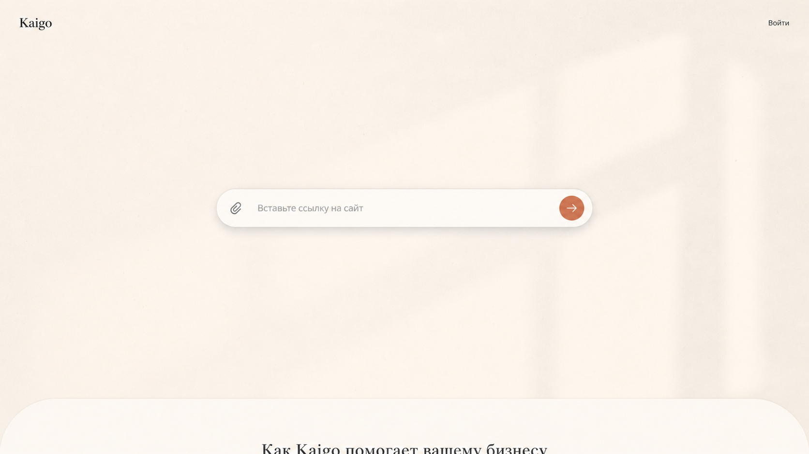
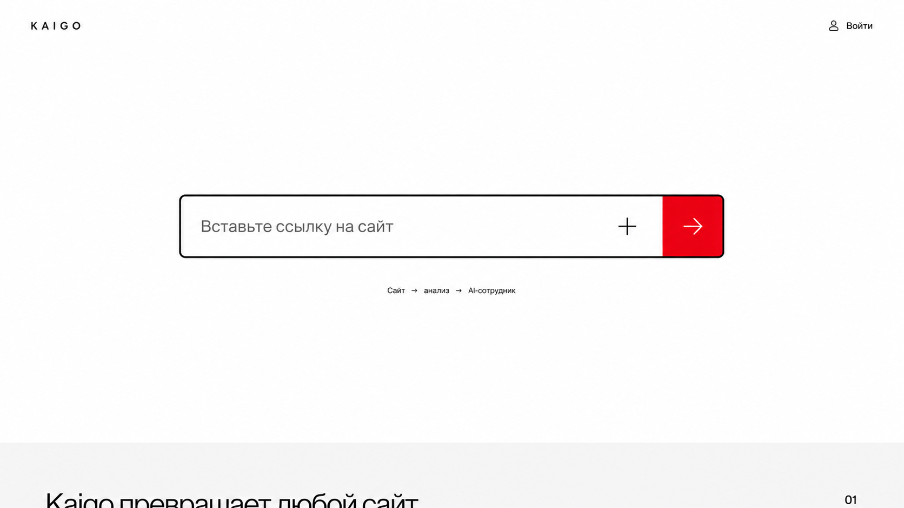
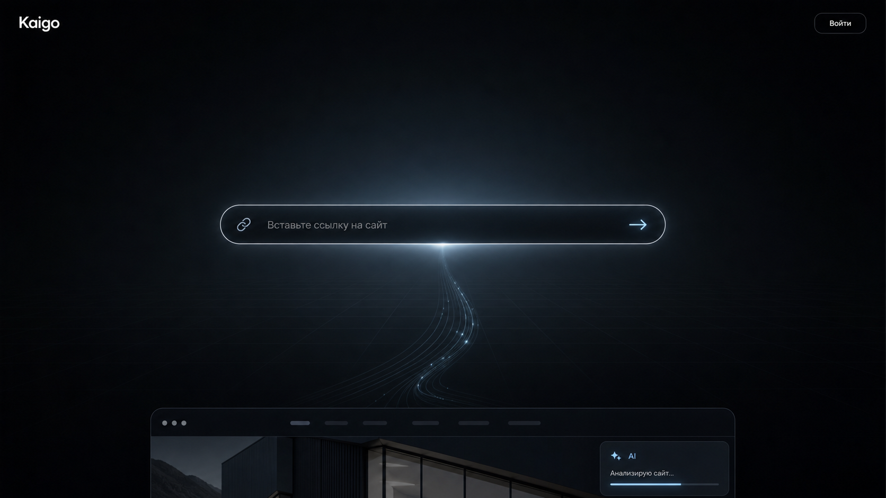
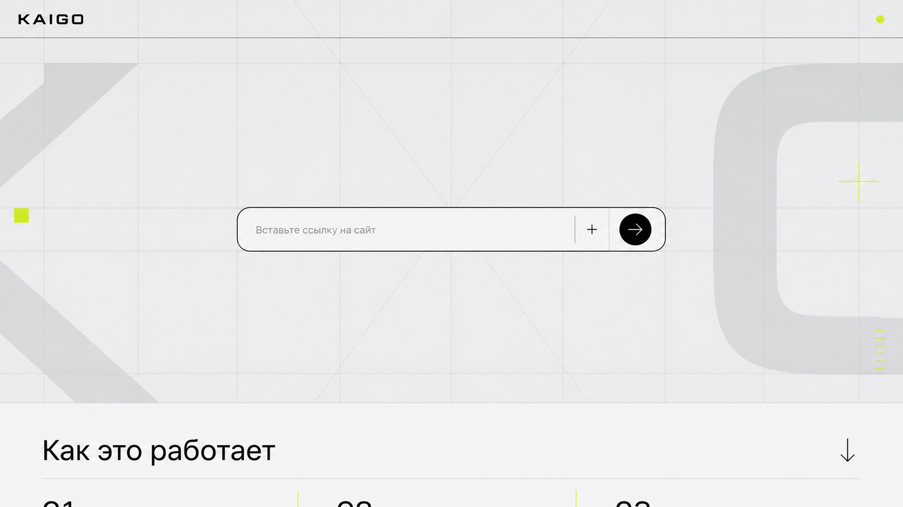
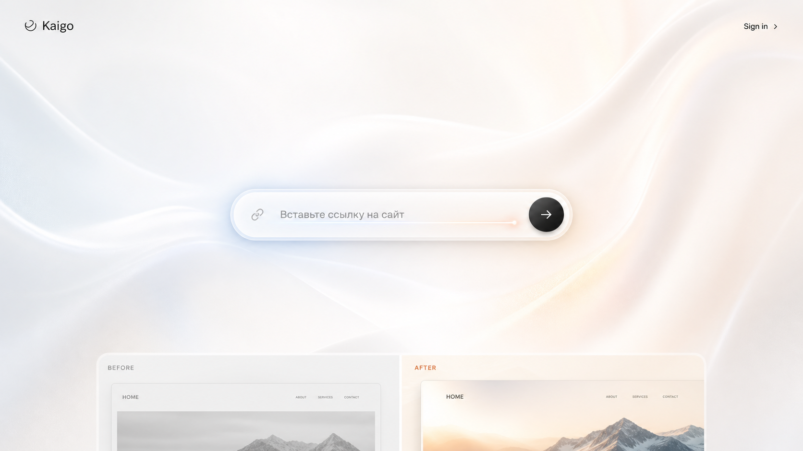

# Пять референсов первого экрана Kaigo

Дата: 26 июля 2026 года

Общая конструкция всех вариантов:

- формат `1672×941`, соотношение сторон `16:9`;
- почти пустой первый экран;
- один composer строго по центру;
- отсутствие большого hero-заголовка и поясняющего текста;
- контентная часть начинается ниже первого экрана.

## Варианты

### 1. Тёплый редакционный

Молочный фон, бумажная фактура, мягкий свет и терракотовый action.

### 2. Строгий монохром

Белое пространство, чёрная рамка и один сигнальный красный action.

### 3. Тёмный пространственный

Графитовая среда, световой объём и ощущение технологического запуска.

### 4. Графическая сетка

Швейцарская сетка, фоновые геометрические знаки и кислотный акцент.

### 5. Мягкий пространственный

Жемчужный фон, органическое световое движение и более эмоциональная подача.

## Первичная оценка

- Вариант 1 — самый спокойный и универсальный.
- Вариант 2 — самый понятный и функциональный.
- Вариант 3 — самый эффектный для демонстрации, но требует аккуратного motion.
- Вариант 4 — самый характерный и лучше всего избегает типового AI-SaaS вида.
- Вариант 5 — самый премиальный, но может стать слишком декоративным.
